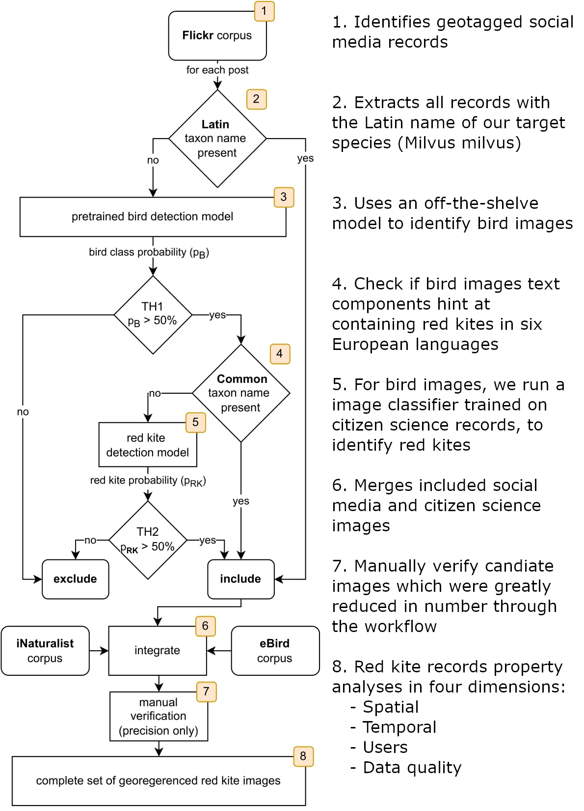

# A text and image analysis workflow using citizen science data to extract relevant social media records: 
## combining red kite observations from Flickr, eBird and iNaturalist

## Outline

This project presents an automated workflow that allows the extraction of target data from social media data ([Flickr](https://flickr.com)). Our workflow leverages both the textual and visual information of a social media post to infer its relevance. We thereby considered Citizen Science data from [eBird](https://ebird.org/home) and [iNaturalist](https://www.inaturalist.org/) as collaborative verified and therefore trust-worthy data to train our image classification model. In our results we focus on a detailed analysis of the various dimensions of data integration such as spatial and temporal coverage, representability and data quality.   

As an exemplary case study we chose to pursue the target species 'Red Kite' (_Milvus milvus_) as topic of interest. The Citizen Science Projects (CSPs) eBird and iNaturalist are know platforms for hosting bird and general species observation data respectively. Flickr on the other hand is a social media platform known to host landscape and nature related photography. Available data on Red Kites is expected to be also found on Flickr, but is not as easily accessible to the other two CSPs since the data is not labelled specifically for this task. Our goal with this project and the code found in this repository is to accommodate an automated workflow for extracting this share of information from Flickr. We thereby draw upon the textual as well as visual components of the Flickr data namely the tags, title and descriptions combined with the photographs to make reliable predictions. The methods necessary to achieve this functionality are visualised in the figure below and encompass simple keyword search for the text (common names for Red Kite in different languages and Latin taxon name) and image classification models for the photographs.




## File descriptions

- `integration_workflow.py` : entire CUDA enabled workflow implementation

- `transfer_learning.ipynb` : the Jupyter notebook to train a custom (e.g. Red Kite) model on Google Colab. Can be adapted to train a new transfer-learning model for a different task

- `transfer_learning.py` : pure version of `transfer_learning.ipynb` if running on a personal cluster/server instance is preferred

## Setup

If you want to use this workflow for your own topic of interest you need to follow the subsequent steps and perform the adjustments were necessary. __Keep in mind that the current data processing is customised towards custom formatted Flickr API metadata.__ Handling other types of data for integration require significant modification to the code base. 

### 1. Install Python environment

`conda create --name <env> --file requirements.txt`

### 2. Train image classification model

Spin up `transfer_learning.ipynb` preferably on Google Colab (Pro) to apply transfer learning to a ResNet50. 

- Connect to your Google Drive
- Build the folder structure `/content/drive/My Drive/ImgClass_Keras/Datasets`
- Store your training and test image samples like e.g. for our Red Kite project:

``` 
	Datasets
		|-- train
			|-- red_kite (change)
			|-- not_red_kite (change)
		|-- test
			|-- red_kite (change)
			|-- not_red_kite (change)
```

- Change PARAMETERS in Jupyter notebook:
	* `IMAGE_SIZE` (dependent on the input layer of the base model)
	* `BATCH_SIZE`
	* `EPOCHES`
	* `LEARNING_RATE`
	* `LOAD_MODEL_FROM_CHECKPOINT` (change to false if no checkpoints from previous training sessions are present)
	* `labels_dict` (holds the amount of training and test data per class for balancing)

### 3. Adapt Python script

All changes here are made to `integration_workflow.py`
 
- __Adapt script parameters__: 
	- Add the absolute path to your input data under `WORKLOAD_PATH`  in line 346
	- Add the absolute path to your transfer-learning model from the setup-step above under `RED_KITE_MODEL_PATH` in line 347
- __Adapt visual analysis parameters__: The subordinate class-name that the pre-trained object detection model needs to detect according to your own specific target needs to be changed. E.g. If you want to detect 'F1-cars' than the subordinate class would be 'car'. The possible subordinate classes available in this implementation are given by the [COCO dataset class-names](https://gist.github.com/AruniRC/7b3dadd004da04c80198557db5da4bda).
Replace string `bird` with your class name (in this example 'car') in line 256

- __Adapt textual analysis parameters__: Change the keywords that are associated with your target. These keywords are ones that would appear in textual data sources such as in the Flickr metadata e.g. title, description, tags. For this change the `taxa_dict` object in line 91


### 4. Run

run `integration_workflow.py` and debug if necessary


## Image classification models

State of the art Convolutional Neural-Networks (CNNs) are used in two instances. Firstly, in the form of a pre-trained COCO initialised ResNet101 that is able to generalise well between roughly 80 subgroups such as 'bird'. Secondly, we applied transfer-learning to a ResNet50 and fitted it based on 20000 Red Kite images and 27500 other bird images from 11 common European birds species (see provided Jupyter notebook `transfer_learning_kreas_blueprint.ipynb`).

The pre-trained model was independently tested and showed an f1-score of 0.93 accuracy on the bird class when tested on 1300 bird images and 1000 non bird images. 

The Red Kite detection model was trained for 500 epochs. The best model version was chosen based on minimal validation loss which was tested on an independent test set of 950 True Positive (TP) Red Kite images and 1111 True Negative (TN) samples. The final model showed a f1-score of 0.839.

## Output

All produces figures are available under `./metadata_analyses/figures`.

## Data

All used images training, validation and testing originate from the CS projects iNaturalist and eBird. The former was acquired with the help of the Python library [pyniaturalist](https://pypi.org/project/pyinaturalist/), specifically their existing script under the path `pyinaturalist\examples\fetch_inaturlist_images.py` which is not included here but which is openly available. The data from eBird was downloaded with the here provided script `ebird_image_fetch.py` which makes requests to the image URLs stored in a CSV file that can be manually downloaded from the eBird official website when querying for a specific taxa.
Flickr was downloaded using https://github.com/Bellador/FlickrFrame.
The raw data is accessible under `./metadata_analyses/data`.
 

