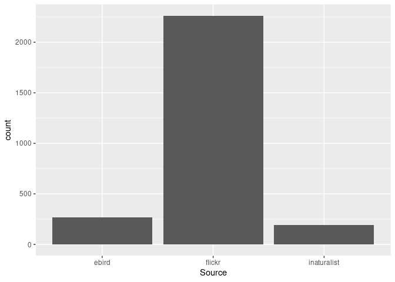
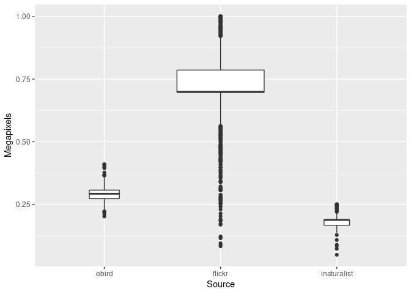
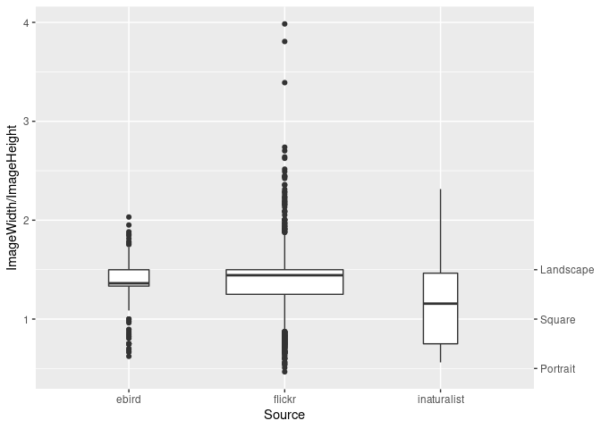
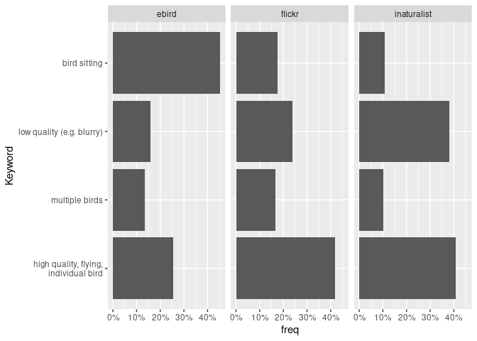

Bird Image Metadata Analyses
================
Moritz Schott
11 11 2021

# No. of images (for self-check)

``` r
imageData%>%
  group_by(Source)%>%
  summarise(n())
```

    ## # A tibble: 3 × 2
    ##   Source      `n()`
    ##   <chr>       <int>
    ## 1 ebird         270
    ## 2 flickr       2262
    ## 3 inaturalist   194

``` r
ggplot(imageData,aes(x=Source))+
  geom_bar()
```

<!-- -->

# Image metadata

## Size

Flickr images have a higher resolution, possibly due to the **social
media** aspect while both other platforms seem to be trimmed to a
certain resolution. Flickr and eBird mostly provide landscape images
while iNaturalist has a large variety of image formats, including
portraits.

``` r
imageData%>%
  mutate(Ratio=ImageWidth/ImageHeight)%>%
  group_by(Source)%>%
  summarise(across(c(Megapixels, Ratio), list(mean=mean, median=median, sd=sd)))%>%
  mutate(across(where(is.numeric), round, 2))%>%
  pivot_longer(-Source) %>% 
  pivot_wider(names_from=Source, values_from=value) 
```

    ## # A tibble: 6 × 4
    ##   name              ebird flickr inaturalist
    ##   <chr>             <dbl>  <dbl>       <dbl>
    ## 1 Megapixels_mean    0.29   0.73        0.18
    ## 2 Megapixels_median  0.29   0.7         0.19
    ## 3 Megapixels_sd      0.03   0.14        0.03
    ## 4 Ratio_mean         1.38   1.36        1.14
    ## 5 Ratio_median       1.36   1.44        1.16
    ## 6 Ratio_sd           0.24   0.31        0.37

``` r
ggplot(imageData,aes(x=Source,y=Megapixels))+
  geom_boxplot(varwidth=TRUE)
```

<!-- -->

``` r
ggplot(imageData,aes(x=Source,y=ImageWidth/ImageHeight))+
  geom_boxplot(varwidth=TRUE)+
  scale_y_continuous(sec.axis = sec_axis(~.,
                                         breaks = c(0.5,1,1.5),
                                         labels = c("Portrait","Square","Landscape")))
```

<!-- -->

# Content

Analyses of the images in terms of content, quality and specialties.

``` r
content<- keywordsData%>%
  group_by(Source)%>%
  mutate(c=n())%>%
  group_by(Keyword,.add=TRUE)%>%
  summarise(freq = n()/min(c))
```

    ## `summarise()` has grouped output by 'Source'. You can override using the
    ## `.groups` argument.

``` r
content %>%
  mutate(across(where(is.numeric), round, 2)) %>%
  pivot_wider(names_from=Source, values_from=freq)
```

    ## # A tibble: 4 × 4
    ##   Keyword                               ebird flickr inaturalist
    ##   <fct>                                 <dbl>  <dbl>       <dbl>
    ## 1 high quality, flying, individual bird  0.25   0.42        0.41
    ## 2 multiple birds                         0.13   0.17        0.1 
    ## 3 low quality (e.g. blurry)              0.16   0.24        0.38
    ## 4 bird sitting                           0.45   0.18        0.11

``` r
ggplot(content,aes(x=Keyword,y=freq))+
    geom_col()+
    facet_wrap(~Source, ncol=3)+
    scale_y_continuous(labels=percent_format(accuracy=1))+
    scale_x_discrete(labels = wrap_format(30))+
    coord_flip()
```

<!-- -->

## Duplicates

No. of session, avg session size.

``` r
keywordsData_orig%>%
  mutate(Keywords=ifelse(str_detect(Keywords, "d_"),Keywords,NA))%>%
  group_by(SourceFile)%>%
  summarise(Keywords=first(na.omit(Keywords)),
            Source=first(Source),
            .groups = "drop")%>%
  mutate(Keywords=coalesce(Keywords,as.character(row_number())))%>%
  group_by(Source)%>%
  summarise(sessions_aka_user_day_locations=n_distinct(Keywords),
            avg_session_length=n()/n_distinct(Keywords),
            images_with_twin=sum(str_detect(Keywords, "d_")),
            ratio_with_twin=images_with_twin/n())%>%
  mutate(cleaned_share=sessions_aka_user_day_locations/sum(sessions_aka_user_day_locations), .after=avg_session_length)%>%
  mutate(across(where(is.numeric), round, 2))%>%
  pivot_longer(-Source) %>% 
  pivot_wider(names_from=Source, values_from=value)
```

    ## # A tibble: 5 × 4
    ##   name                             ebird  flickr inaturalist
    ##   <chr>                            <dbl>   <dbl>       <dbl>
    ## 1 sessions_aka_user_day_locations 135     986         194   
    ## 2 avg_session_length                2       2.29        1   
    ## 3 cleaned_share                     0.1     0.75        0.15
    ## 4 images_with_twin                196    1676           0   
    ## 5 ratio_with_twin                   0.73    0.74        0

# Proposed interpretations

Flickr has a higher amount of archetypal and post-processed images due
to the social media aspect. INaturalist exhibits a high number of low
quality images while EBird seems to favor sitting birds.

Over all Flickr diversifies the data corpus and increases the relative
amount of archetypal images. It does not (strongly) deteriorate the
quality.

This analyses is incomplete for the duplicates, as they need to be
analysed in a second step via the user-id and the time and location of
the image. that information is currently missing or cannot be linked to
single images.

# Further analyses possibilities

The Metadata could be analysed in many other ways. E.g. merging the
image metadata with the platform metadata would show other data insights
and the amount of metadata available. But this would require a more in
depth analyses!

``` r
platformMetadataE<-data.frame(read.csv('data/metadata_platform/ebird_observations_processed.csv',sep=";"),source='ebird')
platformMetadataF<-data.frame(read.csv('data/metadata_platform/flickr_observations_processed.csv',sep=";"),source='Flickr')
platformMetadataI<-data.frame(read.csv('data/metadata_platform/inaturalist_observations_processed.csv',sep=";"),source='INaturalist')

platformMetadata<-bind_rows(platformMetadataE,platformMetadataF,platformMetadataI)
platformMetadata<-platformMetadata %>%
   mutate(across(where(is.character), ~na_if(., "")))
```

The amount of metadata provided is highest for Flickr with both other
platforms being fairly equal. This shows the potential of the integrated
data for new research questions. *Please though note the comment above:
metadata may be discouraged or erased by the platform and not all
metadata is actually useful for the general public (like shutter
speed).* This analyses therefore needs more data in form of the metadata
available on the website.

``` r
imageData$na_count <- apply(imageData, 1, function(x) sum(!is.na(x)))
platformMetadata$na_count <- apply(platformMetadata, 1, function(x) sum(!is.na(x)))

imageData%>%
  group_by(Source)%>%
  summarise(mean=mean(na_count),
            median=median(na_count),
            std=sd(na_count))
platformMetadata%>%
  group_by(source)%>%
  summarise(mean=mean(na_count),
            median=median(na_count),
            std=sd(na_count))
```

## Metadata Analyses

The image metadata analyses, based on the data provided in the images,
is yet incomplete. The following open questions remain:

1.  what additional metadata is available on the website itself, where
    the image was retrieved?

2.  is there any framework interference with the metadata e.g. by
    rewriting it on upload?

3.  which parts of the metadata get manipulated on download?

### Technical details

All images seem to be uploaded in compressed JPEG format (even though
they are saved as PNG?). One image on eBird is actually a video.

``` r
ggplot(imageData,aes(x=FileType,group=1))+
  geom_bar(aes(y=stat(prop)))+
  facet_wrap(~Source, ncol=1)+
  scale_y_continuous(labels=percent)
```

#### Software

The used computer software *can* be a proxy for the technical level of
users. At least it may show a difference between the data sets. Yet this
analyses would need to be run on a user level, not image level. This
would need more metadata in for of the user ids linked to the images.

Yet, it seems that iNaturalists are more Apple people while eBird and
Flickr are more Windows people.

``` r
ggplot(imageData,aes(x=DeviceManufacturer,group=1))+
  geom_bar(aes(y=stat(prop)))+
  facet_wrap(~Source, ncol=3)+
  scale_y_continuous(labels=percent)+
  coord_flip()

ggplot(imageData,aes(x=PrimaryPlatform,group=1))+
  geom_bar(aes(y=stat(prop)))+
  facet_wrap(~Source, ncol=3)+
  scale_y_continuous(labels=percent)+
  coord_flip()
```

The software that created the image may hint to post-processing steps
e.g. using Adobe Photoshop. Flickr has some Adobe usage while eBird has
some Canons.

``` r
ggplot(imageData,aes(x=ProfileCreator,group=1))+
  geom_bar(aes(y=stat(prop)))+
  facet_wrap(~Source, ncol=3)+
  scale_y_continuous(labels=percent)+
  coord_flip()
```
